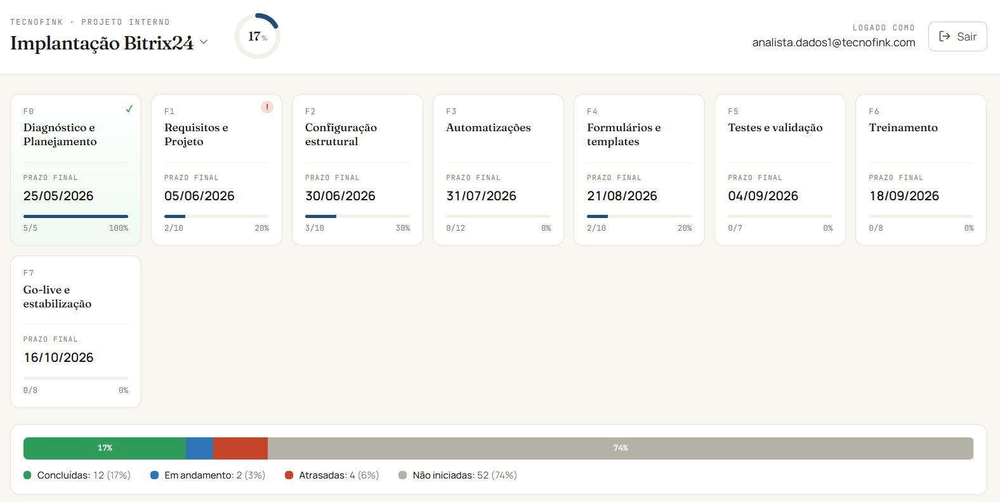
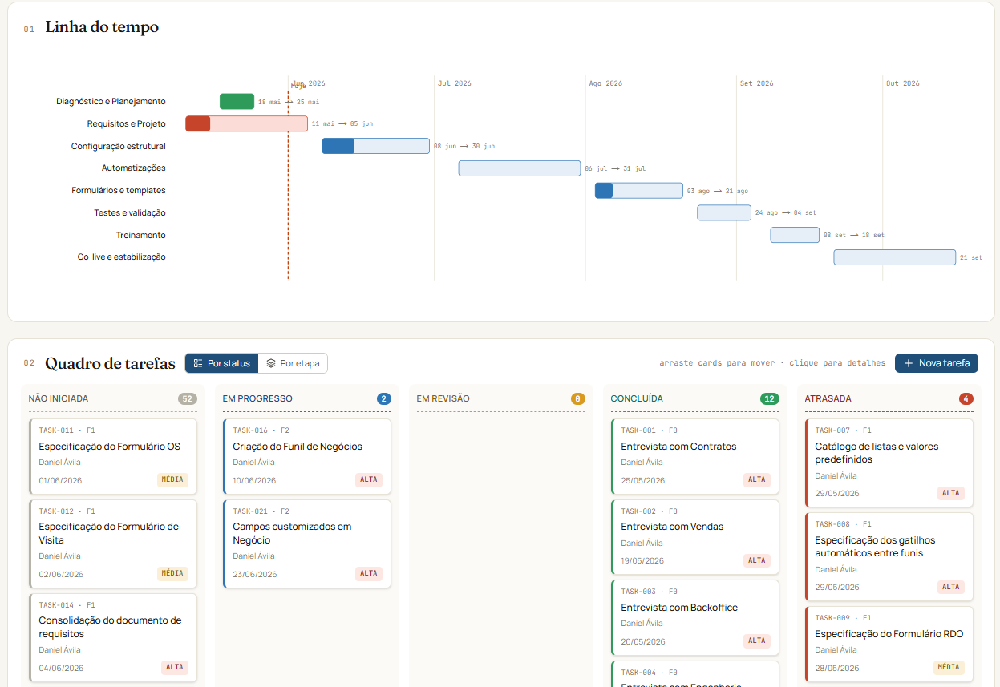

# Gestor de Projetos · CRM Tecnofink

Dashboard de gestão de projetos com kanban, Gantt, controle de etapas, comentários, anexos, multi-projeto, multi-usuário e atualização em tempo real. Construído como parte de uma consultoria de implantação de CRM, atendendo aos requisitos de uma empresa real (Tecnofink) e operando em produção.

🌐 **[Acesso ao demo →](https://tecnofink.vercel.app)**



---

## ✨ Destaques

- **Multi-projeto e multi-usuário** com sistema de papéis (admin, editor, leitor) por projeto.
- **Kanban interativo** com drag-and-drop, undo de 5 segundos e dois modos de visualização (status × etapa).
- **Gantt chart** dinâmico com prazos e dependências por etapa.
- **Comentários e anexos** nas tarefas, com armazenamento de arquivos em Supabase Storage.
- **Realtime**: alterações de uma aba/dispositivo aparecem instantaneamente nas outras (Postgres → WebSocket).
- **Row-Level Security** completa no Postgres + funções `SECURITY DEFINER` para operações sensíveis.
- **Server Actions** do Next.js 16 com revalidação de cache.



---

## 🛠 Stack

| Camada | Tecnologia |
|---|---|
| Framework | Next.js 16 (App Router, Server Actions, Turbopack) |
| Linguagem | TypeScript |
| UI | React 19, Tailwind CSS 4, lucide-react, Babel React Compiler |
| Banco | Supabase (Postgres 17, RLS, Realtime) |
| Auth | Supabase Auth (e-mail + senha, JWT) |
| Storage | Supabase Storage (bucket privado com signed URLs) |
| Deploy | Vercel (CI/CD via GitHub) |

---

## 🏗 Arquitetura em alto nível

```
┌──────────────────┐     ┌─────────────────────┐     ┌──────────────────┐
│   Browser        │     │  Next.js (Vercel)   │     │   Supabase       │
│   (React)        │     │                     │     │   (Postgres)     │
│                  │◄────┤  Server Components  │◄────┤                  │
│  Client          │     │  Server Actions     │     │  Tables          │
│  Components      │────►│  Middleware (proxy) │────►│  RLS Policies    │
│  + Realtime      │     │                     │     │  RPC Functions   │
└──────────────────┘     └─────────────────────┘     └──────────────────┘
        ▲                                                     │
        │                  WebSocket (Realtime)               │
        └─────────────────────────────────────────────────────┘
```

**Decisão central**: operações sensíveis (criar projeto, gerenciar membros, excluir tarefa) passam por funções `SECURITY DEFINER` em PL/pgSQL, chamadas via RPC. Isso bypass de RLS de forma controlada — cada função valida internamente quem é o chamador e suas permissões.

📖 [Mais sobre arquitetura →](docs/arquitetura.md)
📖 [Schema do banco →](docs/schema-banco.md)
📖 [Decisões de design →](docs/decisoes-de-design.md)

---

## 🚀 Como rodar localmente

### Pré-requisitos
- Node.js 20+
- Conta no [Supabase](https://supabase.com) (free tier serve)
- Git

### 1. Clone

```bash
git clone https://github.com/Daniel-MDA/Gestor-de-Projetos.git
cd Gestor-de-Projetos
npm install
```

### 2. Banco de dados

Crie um projeto novo no Supabase e rode os scripts SQL **na ordem**:

```
sql/01_schema_inicial.sql       # tabelas, enums, triggers, RLS base
sql/02_storage_policies.sql     # bucket de anexos
sql/02_criar_projeto.sql        # RPC criar_projeto
sql/03_admin_membros.sql        # gestão de membros (view + RPCs)
sql/04_listar_membros.sql       # RPC para tela de admin
sql/05_zona_perigosa.sql        # arquivar/excluir projeto
sql/06_criar_tarefa.sql         # RPC criar tarefa
sql/07_listar_membros_atribuicao.sql   # select de responsáveis
sql/08_excluir_tarefa.sql       # RPC excluir tarefa + coluna criado_por
```

> Os scripts são idempotentes (`create or replace`). Você pode rodar todos numa sessão.

### 3. Variáveis de ambiente

Crie um arquivo `.env.local` na raiz com:

```env
NEXT_PUBLIC_SUPABASE_URL=https://seuprojeto.supabase.co
NEXT_PUBLIC_SUPABASE_ANON_KEY=eyJhbGc...
```

Valores disponíveis em Supabase → Settings → API.

### 4. Rodar

```bash
npm run dev
```

Abra http://localhost:3000.

---

## 📂 Estrutura

```
src/
├── app/
│   ├── dashboard/          # Dashboard principal: kanban, gantt, tarefas
│   │   ├── Kanban.tsx
│   │   ├── GanttChart.tsx
│   │   ├── TaskModal.tsx
│   │   ├── NewTaskModal.tsx
│   │   ├── Comentarios.tsx
│   │   ├── Anexos.tsx
│   │   └── ... (Server Actions + componentes)
│   ├── login/              # Autenticação
│   └── projetos/
│       ├── novo/           # Criar novo projeto
│       └── [id]/admin/     # Admin de membros + zona perigosa
├── lib/
│   ├── supabase/           # Clients (browser, server, middleware)
│   ├── tarefas.ts          # Tipos, status efetivo, agrupamentos
│   ├── projetos.ts         # Tipos de projeto + papéis
│   ├── responsavel.ts      # Helpers UUID ↔ texto livre
│   └── ... (anexos, comentarios, permissoes, realtime)
└── proxy.ts                # Middleware de sessão Supabase

sql/                        # Migrations idempotentes
docs/                       # Documentação técnica
```

---

## 📜 Funcionalidades em detalhe

### Multi-projeto
Cada usuário pode pertencer a múltiplos projetos com papéis distintos. Trocar de projeto preserva o histórico via cookie. Criar/arquivar/excluir projetos com cascata completa (tarefas, comentários, anexos no banco + arquivos no Storage).

### Kanban com dois modos
- **Por status**: 5 colunas fixas (Não iniciada → Em progresso → Em revisão → Concluída → Atrasada). "Atrasada" é calculada automaticamente quando o prazo vence.
- **Por etapa**: colunas dinâmicas baseadas nas etapas (fases) das tarefas existentes. Suporta scroll horizontal sincronizado no topo para muitas etapas.

Drag-and-drop muda status ou etapa conforme o modo. Toast de undo de 5 segundos. Preferência salva em localStorage.

### Tarefas
- Código sequencial automático (`TASK-001`, `TASK-002`...) por projeto.
- Editar inline ou via modal completo (3 abas: detalhes, comentários, anexos).
- Responsável vinculado a UUID de membro (com fallback para texto livre de tarefas antigas).
- Excluir por admin do projeto **ou** pelo criador da tarefa.

### Realtime
Postgres → Supabase Realtime → WebSocket → React state. Mudanças aparecem em < 1s em todas as abas/dispositivos abertos no mesmo projeto.

### Permissões
3 papéis por projeto:
- **Admin**: edita tudo + gerencia membros + arquiva/exclui projeto
- **Editor**: cria/edita tarefas, comentários, anexos
- **Leitor**: somente visualiza

Proteção do "último admin": não dá pra rebaixar ou remover o único admin do projeto.

---

## 🎨 Design

Visual editorial inspirado em editoriais de negócios:
- Tipografia: **Fraunces** (serif) para títulos, **Inter** para corpo, monospace para metadados
- Paleta: tons quentes e neutros (creme `#f8f6f1`, marfim `#fbfaf6`, tinta `#1a1815`), azul-marinho `#1f4e79` como cor de ação
- Status com cores semânticas (verde concluído, vermelho atrasado, etc.)
- Layout em "papel" — bordas suaves, sombras mínimas, foco no conteúdo

---

## 📦 Deploy

Deploy contínuo via Vercel a cada push em `main`:

[](https://tecnofink.vercel.app)

---

## 👤 Autor

**Daniel Ávila** — Analista de dados focado em CRM e BI. Este projeto foi construído sob demanda real, com ciclos de feedback e ajustes da equipe usuária.

- GitHub: [@Daniel-MDA](https://github.com/Daniel-MDA)

---

## 📄 Licença

Código fonte disponível para fins de portfólio e estudo. Adaptações para outros projetos são bem-vindas — abra uma issue ou entre em contato.
